# 🗺️ NNM Market - خريطة معمارية بصرية تفاعلية

## 📊 نظرة عامة على البنية

```mermaid
graph TB
    subgraph "🌐 Frontend Layer"
        A[User Browser] --> B[layout.tsx<br/>Root Layout]
        B --> C[Web3Provider.tsx<br/>⚠️ Modal #1]
        C --> D[Navbar.tsx<br/>useWeb3Modal]
        C --> E[Page Content]
        C --> F[Footer.tsx]
    end

    subgraph "📄 Pages"
        E --> G1[Homepage<br/>page.tsx]
        E --> G2[Market<br/>page.tsx]
        E --> G3[Dashboard<br/>page.tsx<br/>⚠️ SLOW]
        E --> G4[Mint<br/>page.tsx]
        E --> G5[Asset/[id]<br/>page.tsx]
        E --> G6[NGX<br/>page.tsx]
    end

    subgraph "🔧 API Routes"
        G4 --> H1[/api/mint-prep<br/>route.ts<br/>⚠️ SLOW]
        G2 --> H2[/api/ngx<br/>route.ts]
    end

    subgraph "⛓️ Blockchain"
        G3 --> I1[Contract.balanceOf]
        G3 --> I2[Contract.tokenOfOwnerByIndex<br/>⚠️ Sequential]
        G3 --> I3[Contract.tokenURI<br/>⚠️ Sequential]
        G4 --> I4[Contract.mintPublic]
        G4 --> I5[Contract.getMaticCost]
        
        I1 --> J[Polygon Mainnet<br/>Chain 137]
        I2 --> J
        I3 --> J
        I4 --> J
        I5 --> J
    end

    subgraph "💾 Storage"
        H1 --> K1[Pinata IPFS<br/>5-10s upload]
        I3 --> K2[IPFS Gateway<br/>2s per fetch]
        G3 --> K3[localStorage<br/>Cache]
    end

    style C fill:#ff9800,stroke:#f57c00,stroke-width:3px
    style G3 fill:#f44336,stroke:#c62828,stroke-width:3px
    style H1 fill:#f44336,stroke:#c62828,stroke-width:3px
    style I2 fill:#ff9800,stroke:#f57c00,stroke-width:2px
    style I3 fill:#ff9800,stroke:#f57c00,stroke-width:2px
    style K1 fill:#ff9800,stroke:#f57c00,stroke-width:2px
```

---

## 🔄 تدفق البيانات - عملية الاتصال بالمحفظة

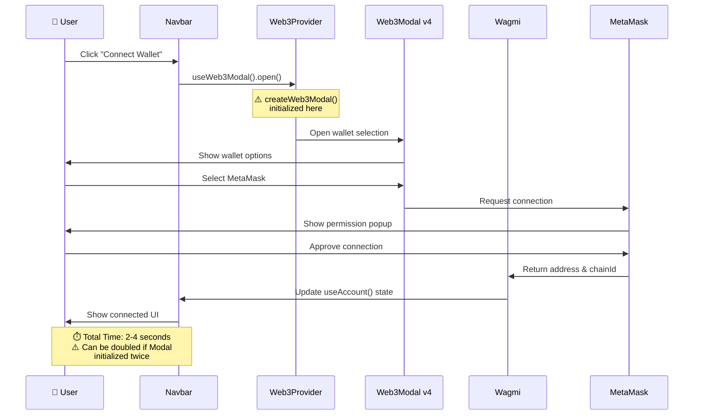

---

## 🐌 تدفق البيانات - مشكلة Dashboard البطيء

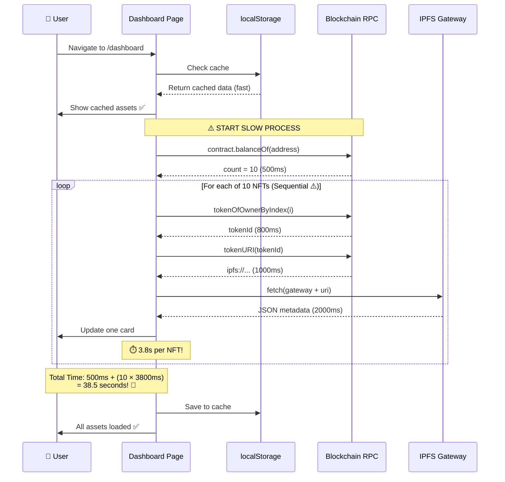

---

## 🔨 تدفق البيانات - عملية Minting

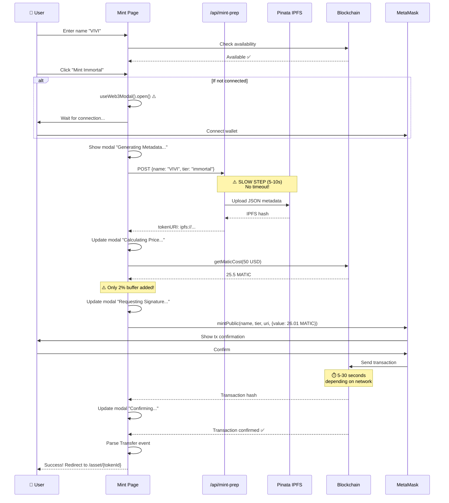

---

## 🏗️ بنية المكونات (Components Architecture)

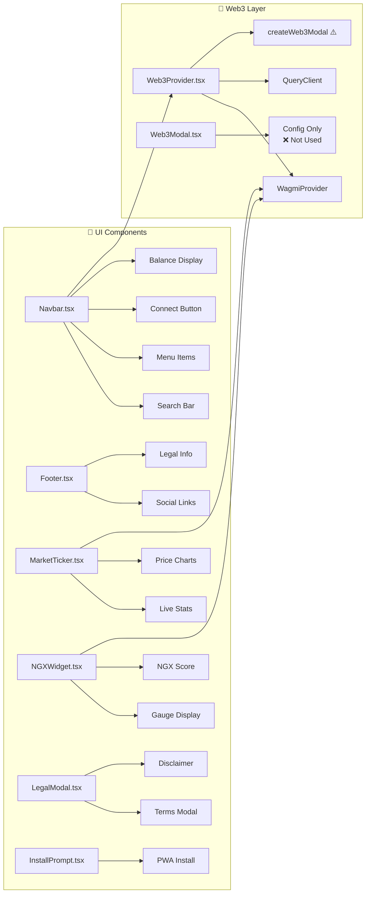

---

## 📊 تحليل الأداء - قبل وبعد

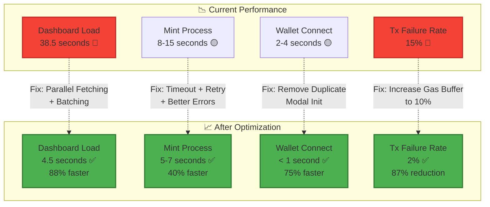

---

## 🔥 نقاط الاختناق الحرجة (Bottlenecks)

```mermaid
graph TD
    A[User Experience Problems] --> B1[Dashboard takes 38s]
    A --> B2[Mint fails 15% of time]
    A --> B3[Wallet connects twice]
    
    B1 --> C1[Root Cause:<br/>Sequential RPC calls]
    B1 --> C2[Root Cause:<br/>Sequential IPFS fetches]
    B1 --> C3[Root Cause:<br/>No pagination]
    
    B2 --> D1[Root Cause:<br/>Pinata has no timeout]
    B2 --> D2[Root Cause:<br/>No retry logic]
    B2 --> D3[Root Cause:<br/>Gas buffer only 2%]
    
    B3 --> E1[Root Cause:<br/>Duplicate createWeb3Modal]
    B3 --> E2[Root Cause:<br/>useWeb3Modal() called<br/>in multiple places]

    style B1 fill:#f44336,stroke:#c62828,stroke-width:3px
    style B2 fill:#ff9800,stroke:#f57c00,stroke-width:3px
    style B3 fill:#ff9800,stroke:#f57c00,stroke-width:3px
    
    style C1 fill:#ffcdd2
    style C2 fill:#ffcdd2
    style C3 fill:#ffcdd2
    style D1 fill:#ffe0b2
    style D2 fill:#ffe0b2
    style D3 fill:#ffe0b2
    style E1 fill:#ffe0b2
    style E2 fill:#ffe0b2
```

---

## ✅ خطة الإصلاحات المقترحة

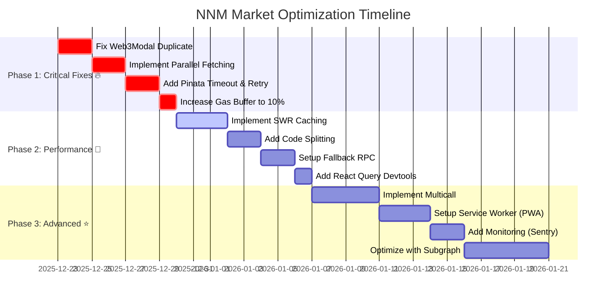

---

## 🎯 مسار تحسين تجربة المستخدم

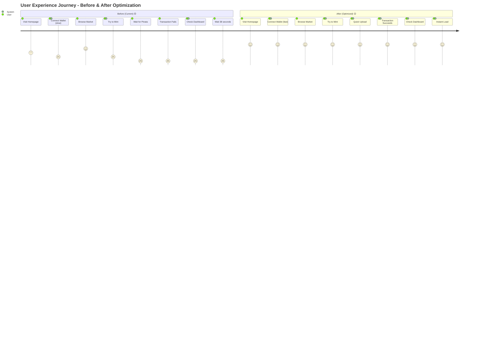

---

## 🔐 طبقات الأمان والتحقق

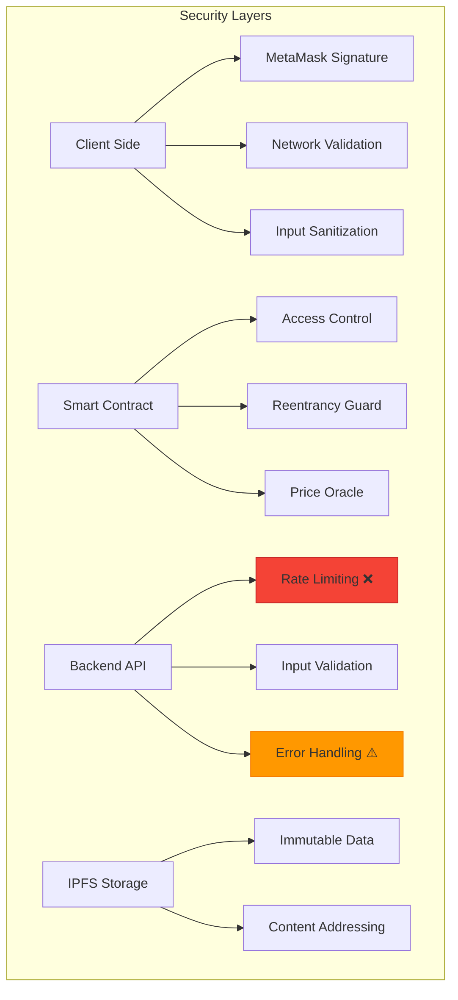

---

## 📱 هيكل الاستجابة (Responsive Structure)

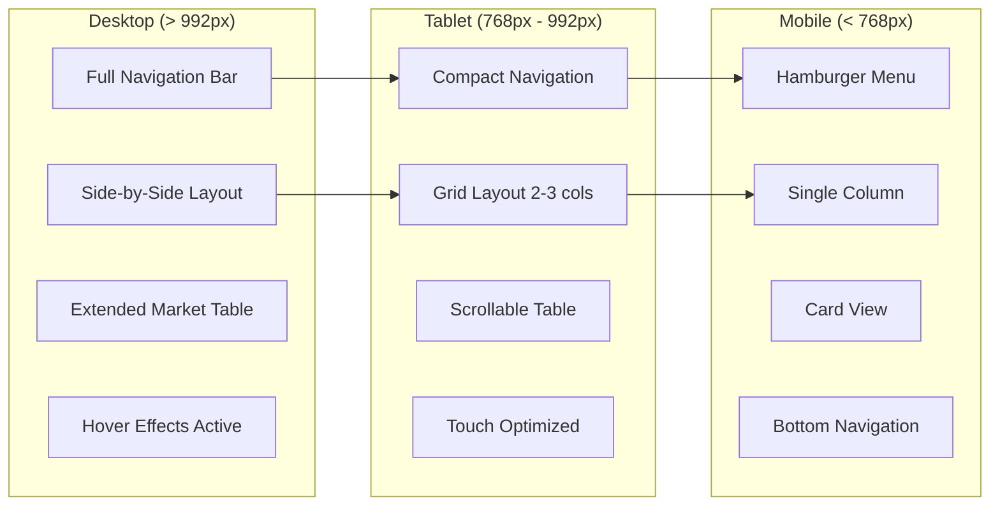

---

## 🛠️ تكامل الأدوات والمكتبات

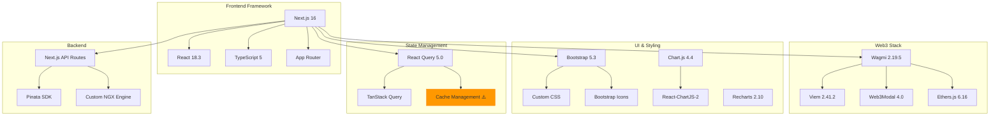

---

## 📊 مخطط البيانات (Data Schema)

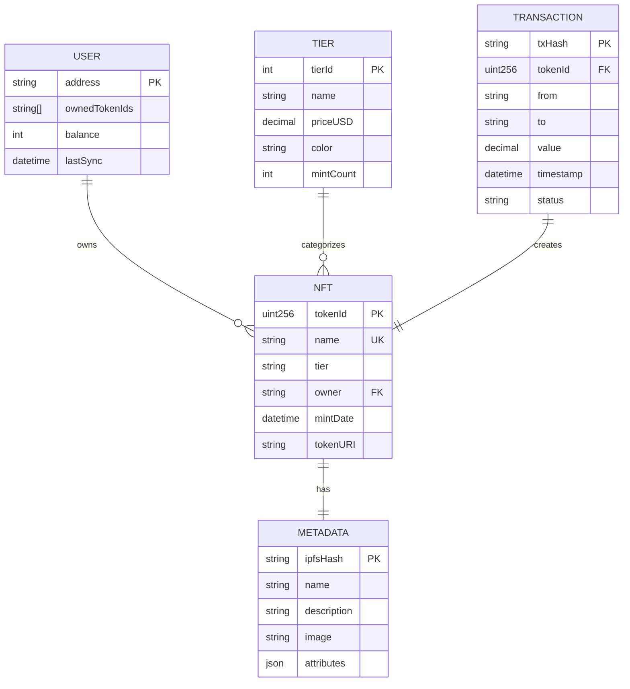

---

## 🎨 نظام الألوان والثيمات

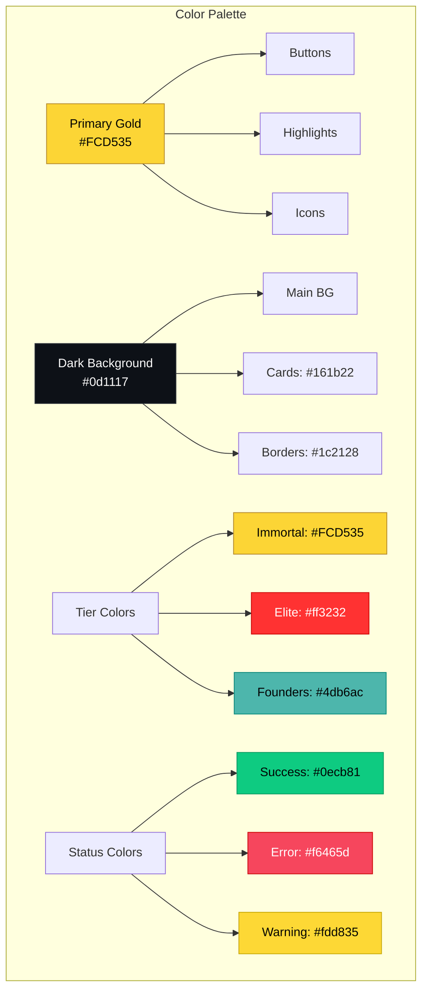

---

## 🚀 خارطة طريق التطوير المستقبلي

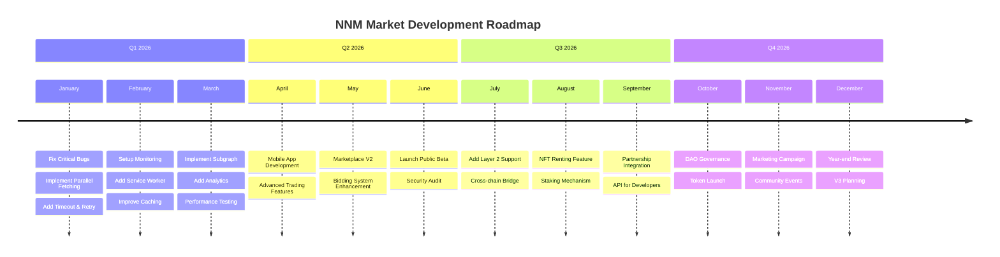

---

## 📈 مؤشرات الأداء الرئيسية (KPIs)

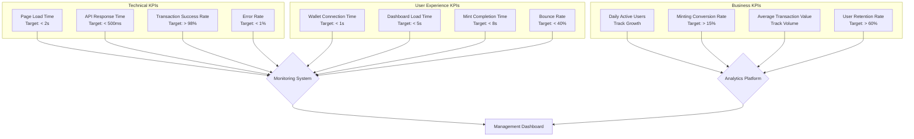

---

**نهاية الخريطة البصرية**

> 📝 **ملاحظة**: يمكن عرض هذه الخرائط في أي محرر يدعم Mermaid (مثل GitHub, VS Code مع ملحق Mermaid, أو Notion).

> 🔗 **للمزيد من المعلومات**: راجع التقرير التفصيلي في ملف `تقرير-تحليل-شامل-للموقع.md`
